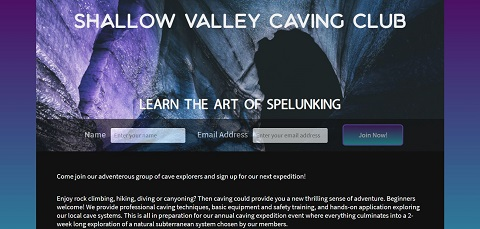
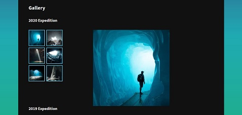
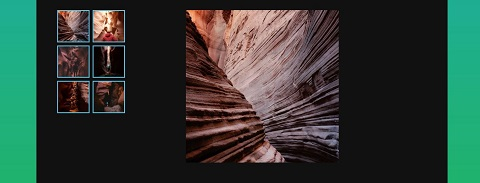

# Responsive Club Website

Responsive Club Website is one of Codecademy's open-ended projects, in which it is encouraged to problem solve and utilize other resources, instead of being provided with step-by-step guidance. The requirements were to build a webpage for a local club that could be based on a real-life organization or our own made up club. We were responsible for the structure and all design aspects, such as the club name, page layout, styling and images to use. We also were instructed to incorporate elements of responsive design such as using media queries that would dynamically resize elements on the page based on the size of the screen, or changing the page layout depending on size breakpoints.

## Table of Contents

- [Technologies](#technologies)
- [Screenshots](#screenshots)
- [Status](#status)

## Technologies

This project was created with:

- HTML5
- CSS3 (SCSS)

## Screenshots

## Status

This project has been completed.